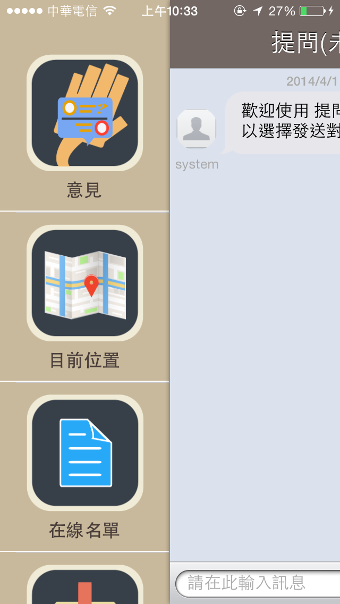
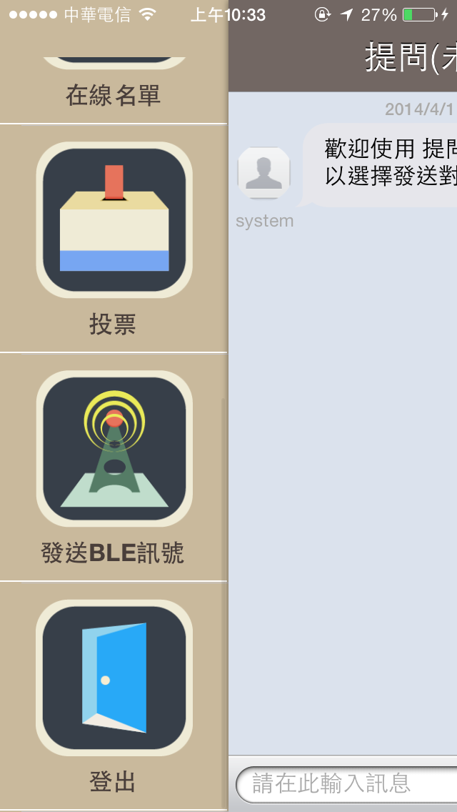

TKU_Hackthon_iOS
================

TKU_Hackthon_iOS

using iBeacon,WebSocket(Soocket.IO)

<h4>一個利用iBeacon技術來自動幫學生簽到上課的系統。</h4>
<h4>當學生上課有問題卻不知該如何發問時，學生可透過課堂的聊天室匿名發問。</h4>   

<h4>查看課表</h4>
<h4>進入教室時，會感應iBeacon自動簽到</h4>
<h4>簽到後老師端的手機與電腦會顯示該學生已到場</h4>
<h4>上課時學生可透過匿名發問，對老師提出課程上的問題</h4>
<h4>學生提出的問題會顯示在老師的螢幕上</h4>

